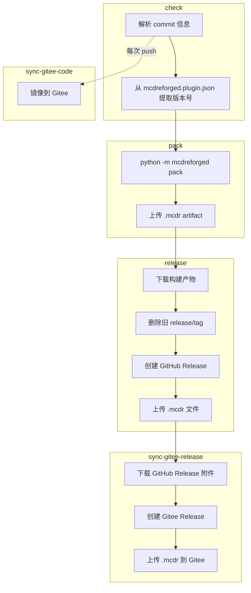

# GitHub Actions 工作流指南

本仓库使用 GitHub Actions 进行持续集成和部署。当代码推送到 `main` 分支时，工作流会自动触发。

## 📋 概述

CI/CD 流水线完全由 **commit 信息中的关键词** 驱动。推送到 `main` 分支时，只需在 commit message 中包含对应关键词，GitHub Actions 会自动完成后续工作。

## 🔑 关键词

| Commit 信息中的关键词 | 打包 .mcdr | GitHub Release | Gitee 同步 |
|----------------------|:---:|:---:|:---:|
| `build action` | ✅ | ❌ | ❌ |
| `build release` | ✅ | ✅ | ✅ |
| 推送 `v*` tag（如 `v0.5.0`） | ✅ | ✅ | ✅ |

### 使用示例

```bash
# 仅打包测试（不发布）
git commit -m "feat: 添加新功能 build action"

# 打包并发布到 GitHub + Gitee
git commit -m "feat: 发布新版本 build release"

# 推送 tag 自动打包+发布（无需关键词）
git tag v0.5.0
git push github v0.5.0
```

## 📦 流水线阶段

```
check ──→ pack ──→ release ──→ sync-gitee-release
  │         │         │              │
  │         │         │              ├─ 下载 GitHub Release 附件
  │         │         │              ├─ 通过 Gitee API 创建 Release
  │         │         │              └─ 上传 .mcdr 到 Gitee
  │         │         │
  │         │         └─ 下载构建产物
  │         │            删除旧的 release/tag
  │         │            创建 GitHub Release
  │         │            上传 .mcdr 文件
  │         │
  │         └─ python -m mcdreforged pack
  │            上传 .mcdr artifact
  │
  └─→ sync-gitee-code（与 check 并行，每次 push 触发）
       通过 hub-mirror-action 镜像所有分支/标签到 Gitee
```

### 流水线流程图



## 🔄 Gitee 同步

自动将代码镜像到 [Gitee](https://gitee.com/vincent-zyu/mcdr_listener_ws_server)（国内 GitHub 替代，方便大陆用户访问）。

### sync-gitee-code — 代码镜像

**每次 push 时运行**（与 `check` job 并行）：
- 使用 [Yikun/hub-mirror-action](https://github.com/Yikun/hub-mirror-action) 镜像所有分支、标签和提交
- 自动触发，无需关键词

### sync-gitee-release — Release 镜像

**在 `release` job 成功后运行**：
1. 下载 GitHub Release 的所有附件
2. 通过 Gitee API 创建对应的 Release
3. 上传所有 .mcdr 文件到 Gitee Release

### 前置条件

| 密钥 | 获取方式 | 用途 |
|------|----------|------|
| `GITEE_PRIVATE_KEY` | SSH 密钥对（见下方配置步骤） | 通过 hub-mirror-action 推送代码 |
| `GITEE_TOKEN` | [Gitee 个人访问令牌](https://gitee.com/profile/personal_access_tokens) | 通过 API 创建 Release 和上传附件 |

### 配置步骤

1. **生成 SSH 密钥对**（如果还没有）：

   **Linux / macOS / Git Bash：**
   ```bash
   ssh-keygen -t ed25519 -C "gitee-sync-mcdr-listener-ws-server" -f ~/.ssh/gitee_sync_mcdr_listener_ws_server
   cat ~/.ssh/gitee_sync_mcdr_listener_ws_server.pub   # 公钥 → 添加到 Gitee
   cat ~/.ssh/gitee_sync_mcdr_listener_ws_server       # 私钥 → 添加到 GitHub Secrets
   ```

   **Windows PowerShell：**
   ```powershell
   ssh-keygen -t ed25519 -C "gitee-sync-mcdr-listener-ws-server" -f "$env:USERPROFILE\.ssh\gitee_sync_mcdr_listener_ws_server"
   cat ~/.ssh/gitee_sync_mcdr_listener_ws_server.pub   # 公钥 → 添加到 Gitee
   cat ~/.ssh/gitee_sync_mcdr_listener_ws_server       # 私钥 → 添加到 GitHub Secrets
   ```

   > **注意：** PowerShell 中 `ssh-keygen -f` 参数不支持 `~`，需要用 `$env:USERPROFILE`。但 `cat` 可以正常解析 `~`。

2. **在 Gitee 添加公钥**：
   - 打开 [Gitee SSH 公钥设置](https://gitee.com/profile/sshkeys)
   - 添加 `~/.ssh/gitee_sync_mcdr_listener_ws_server.pub` 的内容

3. **在 GitHub 仓库添加私钥**：
   - 打开仓库 **Settings → （左下角）Secrets and variables → Actions**
   - 点击 **New repository secret**
   - Name: `GITEE_PRIVATE_KEY`
   - Value: `~/.ssh/gitee_sync_mcdr_listener_ws_server` 私钥文件的完整内容（包括 `-----BEGIN` 和 `-----END` 行）

4. **确保 Gitee 仓库存在**：
   - 在 Gitee 创建同名仓库：`mcdr_listener_ws_server`
   - 仓库地址：`https://gitee.com/vincent-zyu/mcdr_listener_ws_server`

5. **创建 Gitee 个人访问令牌**：
   - 打开 [Gitee 个人访问令牌](https://gitee.com/profile/personal_access_tokens)
   - 点击「生成新令牌」，勾选 `projects` 权限
   - 复制生成的 Token

6. **在 GitHub 仓库添加 Gitee Token**：
   - 打开仓库 **Settings → Secrets and variables → Actions**
   - 点击 **New repository secret**
   - Name: `GITEE_TOKEN`
   - Value: 上一步复制的 Gitee 个人访问令牌

## 📌 版本号

版本号自动从 `mcdreforged.plugin.json` 中的 `version` 字段提取，用于：
- Release 标签名（如 `v0.5.0-beta.1`）
- 产物文件名（如 `mcdr_listener_ws_server-v0.5.0-beta.1.mcdr`）

## 📥 安装说明

下载 `.mcdr` 文件后：

1. 放入 MCDR 的 `plugins/` 目录
2. 确保已安装依赖：
   ```bash
   pip install mcdreforged websockets>=15.0.0 Pillow>=10.0.0 requests>=2.32.0
   ```
3. 在 MCDR 控制台执行：`!!MCDR plg reload mcdr_listener_ws_server`

## ⚙️ 前置条件汇总

| 密钥 | 获取方式 | 用途 |
|------|----------|------|
| `GITEE_PRIVATE_KEY` | SSH 私钥（见上方配置步骤 1-3） | 镜像代码到 Gitee |
| `GITEE_TOKEN` | [Gitee 个人访问令牌](https://gitee.com/profile/personal_access_tokens)（见配置步骤 5-6） | 创建 Gitee Release 和上传附件 |

> **注意：** `GITHUB_TOKEN` 由 GitHub Actions 自动提供，无需手动配置。
