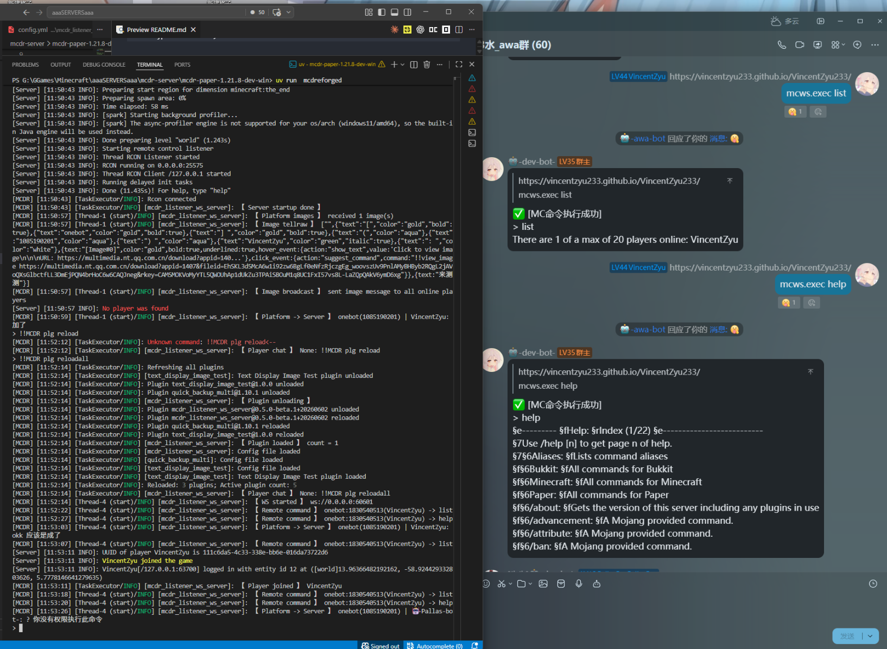

# mcdr_listener_ws_server

> **[📖 English](README.en-us.md)**
> **[📖 中文](README.md)**

[](https://mcdreforged.com/zh-CN)

[](https://github.com/VincentZyuApps/mcdr_listener_ws_server)
[](https://gitee.com/vincent-zyu/mcdr_listener_ws_server)

[](https://qm.qq.com/q/ZN7fxZ3qCq)

<p><del>💬 Plugin usage / 🐛 Bug reports / 👨‍💻 Dev discussions, join QQ group: <b>259248174</b> 🎉 (this group is dead)</del> </p> 
<p>💬 Plugin usage / 🐛 Bug reports / 👨‍💻 Dev discussions, join QQ group: <b>1085190201</b> 🎉</p>
<p>💡 Mention me in the group for faster responses~ ✨</p>

---

A group-server bridge plugin: **text & images** from chat platforms ⇄ **chat & join/leave events** from Minecraft Java servers.

Supports Koishi Bot — theoretically works with most platforms Koishi supports (QQ OneBot v11 / Kook / Discord / Telegram).
> Ready-made Koishi plugin: https://github.com/VincentZyuApps/koishi-plugin-mclistener-ws-client
> My test & production environment: QQ OneBot V11 / Discord
You can also write your own plugin to integrate with other bot frameworks, such as [Koishi](https://koishi.chat/zh-CN/manual/starter/boilerplate.html), [Nonebot2](https://nonebot.dev/docs/quick-start), [Astrbot](https://docs.astrbot.app/deploy/astrbot/docker.html), or any other web application via a [WebSocket](https://github.com/websockets/ws) client.

Supports select Minecraft Java server distributions managed by MCDReforged.
> My test & production environment: Spigot / Paper 1.21.8

### What It Does

**→ Chat Platform → MC Server**
- Forward text messages into the game
- Render image messages as in-game `text_display` (tested with OneBot v11)


**→ MC Server → Chat Platform**
- Forward player chat messages to the platform
- Forward player join/leave notifications to the platform


**→ Inside MC Server**
- Players can use `!!view_image <url>` to view remote images manually

**→ Chat Platform → MC Server (Remote Command Execution)**
- Execute MC server RCON commands from the chat platform, results sent back to chat


## Installation

Place the plugin in MCDR's plugin directory and ensure dependencies are installed:

- `mcdreforged >= 2.13.0`
- `websockets >= 15.0.0`
- `Pillow >= 10.0.0`
- `requests >= 2.32.0`

```powershell
uv pip install mcdreforged
uv pip install -r requirements.txt
```

> On Windows, set MCDR's `config.yml` encoding to `GBK` to avoid emoji / character encoding issues.

## Configuration

Auto-generated from the bundled `resources/` template at `config/mcdr_listener_ws_server/config.yml` on first load:

> The plugin supports i18n — player-facing messages can be customized in the `lang/` directory (`zh_cn.yml` / `en_us.yml`).

| Key | Description | Default |
|-----|-------------|---------|
| `host` | 🌐 WebSocket listen address | `0.0.0.0` |
| `port` | 🔌 WebSocket listen port | `60601` |
| `ws_token` | 🔑 WebSocket connection token (empty=no auth) ⚠️ default is for testing only | `"test12345"` |
| `enable_remote_exec_command` | ⚡ Enable remote command execution | `false` |
| `remote_exec_command_whitelist` | 🛡️ Allowed command prefixes (empty=allow all) | `[]` |
| `remote_exec_command_timeout_sec` | ⏱️ Command execution timeout (seconds) | `10` |
| `remote_exec_result_max_length` | 📏 Max length of command result output | `4000` |
| `cache_dir` | 📂 Image cache directory | `./cache/mcdr_listener_ws_server/images/` |
| `image_max_side_length` | 📐 Max side length of displayed images | `64` |
| `image_duration_sec` | ⏱️ Image display duration (seconds) | `10` |
| `image_cache_ttl_sec` | 🧹 Image cache retention time (seconds) | `180` |
| `image_host_whitelist` | 🛡️ Allowed image URL hosts | `multimedia.nt.qq.com.cn`, `gxh.vip.qq.com` |

> For local testing (run a WS client locally to simulate a chat platform), add `127.0.0.1` to `image_host_whitelist` in the generated config file `config/mcdr_listener_ws_server/config.yml`:
> ```yaml
> image_host_whitelist:
>   - multimedia.nt.qq.com.cn
>   - gxh.vip.qq.com
>   - 127.0.0.1
> ```

## Commands

### `!!view_image <url>`

Renders a remote image as a `text_display` entity in front of the player.  
Requires: executed by a player + image host in the whitelist.  
Feedback text is loaded from `lang/` language files and can be customized.

## WebSocket Event Format

### Server Broadcast Events

#### Player Join 🎉

```json
{
    "type": "player_join",
    "player_name": "some_name"
}
```

#### Player Leave 😢

```json
{
    "type": "player_leave",
    "player_name": "some_name"
}
```

#### Player Chat 💬

```json
{
    "type": "player_chat",
    "player_name": "some_name",
    "content": "some_content"
}
```

### Client Inbound Events

Send the following JSON messages from the client to the server.

#### Platform Message Forwarding 📨

```json
{
    "type": "group_to_server",
    "nickname": "username",
    "message": "message content",
    "group_id": "123456",
    "group_name": "group name",
    "images": [
        {
            "url": "https://example.com/image.png",
            "name": "image.png"
        }
    ]
}
```

`images` field is optional. When present, images will be rendered as `text_display` entities in-game.

#### Remote Command Execution 🖥️

```json
{
    "type": "command",
    "command": "list"
}
```

The server will respond with the execution result:

```json
{
    "type": "command_result",
    "command": "list",
    "result": "..."
}
```

> ⚠️ **Prerequisite: Enable RCON**
>
> The remote command execution feature relies on the Minecraft server's RCON interface. Before using it, ensure:
>
> 1. **Minecraft Server**: Enable RCON in `server.properties`
>    ```properties
>    enable-rcon=true
>    rcon.port=25575
>    rcon.password=your_rcon_password
>    ```
> 2. **MCDR Main Config**: Configure RCON in MCDR's `config.yml` (the plugin executes commands via MCDR's RCON interface)
>    ```yaml
>    rcon:
>      enable: true
>      address: 127.0.0.1
>      port: 25575
>      password: your_rcon_password
>    ```
