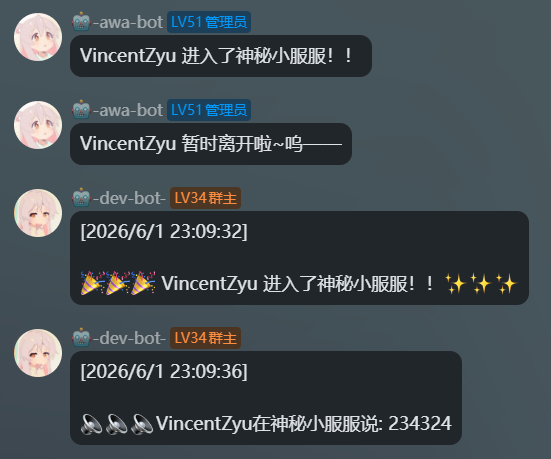

# mcdr_listener_ws_server

[🇬🇧 English](README.en-us.md)

[](https://mcdreforged.com/zh-CN)

[](https://github.com/VincentZyuApps/mcdr_listener_ws_server)
[](https://gitee.com/vincent-zyu/mcdr_listener_ws_server)

[](https://qm.qq.com/q/ZN7fxZ3qCq)

<p><del>💬 插件使用问题 / 🐛 Bug反馈 / 👨‍💻 插件开发交流，欢迎加入QQ群：<b>259248174</b>   🎉（这个群G了</del> </p> 
<p>💬 插件使用问题 / 🐛 Bug反馈 / 👨‍💻 插件开发交流，欢迎加入QQ群：<b>1085190201</b> 🎉</p>
<p>💡 在群里直接艾特我，回复的更快哦~ ✨</p>

---

聊天平台 **图文消息** ⇄ Minecraft Java服务器 **文字消息与进出服事件** 的群服互通插件。

支持 Koishi Bot 接入，理论上 Koishi 支持的大部分聊天平台均可使用（QQ OneBot v11 / Kook / Discord / Telegram）。
> 已有现成的Koishi 插件: https://github.com/VincentZyuApps/koishi-plugin-mclistener-ws-client
> 我自己的测试环境和生产环境: QQ OneBot V11 / Discord
当然你也可以自己编写插件把他接入到其他的Bot框架，比如[Koishi](https://koishi.chat/zh-CN/manual/starter/boilerplate.html)，[Nonebot2](https://nonebot.dev/docs/quick-start)，[Astrbot](https://docs.astrbot.app/deploy/astrbot/docker.html)等等，或者其他任何形式的Web应用的 [WebSocket](https://github.com/websockets/ws)客户端接入。

支持 MCDReforged 部分 Minecraft Java 服务端发行版。
> 我自己的测试环境和生产环境: Spigot / Paper 1.21.8

### 它能做什么

**→ 聊天平台 → MC 服务器**
- 文字消息转发到游戏内
- 图片消息渲染为游戏内 `text_display`（已实测 OneBot v11）


**→ MC 服务器 → 聊天平台**
- 玩家聊天消息转发到平台
- 玩家加入/退出服务器通知转发到平台


**→ MC 服务器内**
- 玩家可用 `!!view_image <url>` 命令手动查看远程图片

## 安装

将插件放入 MCDR 插件目录，确保依赖已安装：

- `mcdreforged >= 2.13.0`
- `websockets >= 15.0.0`
- `Pillow >= 10.0.0`
- `requests >= 2.32.0`

```powershell
uv pip install mcdreforged
uv pip install -r requirements.txt
```

> 若在 Windows 下运行，建议MCDR的`config.yml`的encoding和coding都改成`GBK`，避免 emoji 等字符问题。

## 配置

首次加载后自动从 `resources/` 释放默认配置模板到 `config/mcdr_listener_ws_server/config.yml`，主要选项：

> 插件支持国际化（i18n），玩家可见消息文本可在 `lang/` 目录下按需修改（`zh_cn.yml` / `en_us.yml`）。

| 配置项 | 说明 | 默认值 |
|--------|------|--------|
| `host` | 🌐 监听地址 | `0.0.0.0` |
| `port` | 🔌 监听端口 | `60601` |
| `cache_dir` | 📂 图片缓存目录 | `./cache/mcdr_listener_ws_server/images/` |
| `image_max_side_length` | 📐 图片最大边长 | `64` |
| `image_duration_sec` | ⏱️ 图片展示时长 | `10` |
| `image_cache_ttl_sec` | 🧹 图片缓存保留时长（秒） | `180` |
| `image_host_whitelist` | 🛡️ 图片域名白名单 | `multimedia.nt.qq.com.cn`, `gxh.vip.qq.com` |

> 如需本地测试（本地起一个 WS 客户端模拟聊天平台接入），可在生成的配置文件 `config/mcdr_listener_ws_server/config.yml` 中将 `127.0.0.1` 加入 `image_host_whitelist`：
> ```yaml
> image_host_whitelist:
>   - multimedia.nt.qq.com.cn
>   - gxh.vip.qq.com
>   - 127.0.0.1
> ```

## 命令

### `!!view_image <url>`

玩家执行后在面前以 `text_display` 展示远程图片。  
需满足：由玩家执行 + 图片域名在白名单内。  
命令反馈文本从 `lang/` 语言文件读取，支持自定义。

## WebSocket 事件格式

### 服务端广播事件

#### 玩家进入 🎉

```json
{
    "type": "player_join",
    "player_name": "some_name"
}
```

#### 玩家离开 😢

```json
{
    "type": "player_leave",
    "player_name": "some_name"
}
```

#### 玩家聊天 💬

```json
{
    "type": "player_chat",
    "player_name": "some_name",
    "content": "some_content"
}
```

### 客户端入站事件

客户端向服务端发送以下 JSON 消息。

#### 平台消息转发 📨

```json
{
    "type": "group_to_server",
    "nickname": "用户名",
    "message": "消息内容",
    "group_id": "123456",
    "group_name": "群名称",
    "images": [
        {
            "url": "https://example.com/image.png",
            "name": "image.png"
        }
    ]
}
```

`images` 字段可选，携带时会在游戏内以 `text_display` 实体渲染展示图片。

#### 远程命令执行 🖥️

```json
{
    "type": "command",
    "command": "list"
}
```

服务端执行后将返回结果：

```json
{
    "type": "command_result",
    "command": "list",
    "result": "..."
}
```
